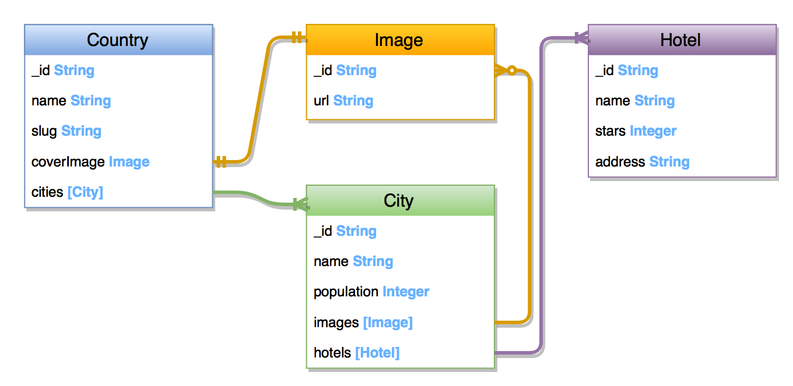

# graphql-hotels-example

Tired of TodoMVC? So do I.

## What is it?
This is yet another example of GraphQL server.
It provides you GraphQL backend, so you can play with queries in the [GraphiQL](https://github.com/graphql/graphiql).
While implementing this example I was trying to keep backend simple but provide clear and meaningful schema.

#### Features
* To keep it simple this example uses in-memory storage. Initial data located in [data.json](/storage/data.json) file.
* [GraphiQL](https://github.com/graphql/graphiql) tool enabled and it is a way to play with GraphQL.
* There is no frontend part. (But it would be good to implement example clients using Relay. `react-native` example in progress.)

## Domain, Diagram and Schema. Small Intro.

#### What is our app about?
Let's imagine we are developing tourist guide program.
* There is information about `Countries` our user may plan to visit.
* Each `Country` contains `Cities`.
* And each `City` has a bunch of `Hotels`.

Wait, what the backend without nice images? We will add `Image` to `Country` and list of `Images` for each `City`.

Now we can review the Relations Diagram.

#### Relations Diagram


#### Schema
Our schema allow us to fetch any shape of data.
For this we need to add entry points for lists and individual entity:
* `countries` - List of `Countries`. For index page of our application with countries.
* `country(countryID)` - Particular `Country` by ID. For individual `Country` page.
* `city(cityID)` - Particular `City` by ID. For individual `City` page.
* `hotel(hotelID)` - Particular `Hotel` by ID. For individual `Hotel` page.

##### About `node` entry point.
Have you noticed some kind of duplication in `country`, `city`, `hotel`?
For avoiding this Relay provides us ability to use one entry point for all individual entities called `node`:
* `node(ID)` - Where `ID` is GraphQL UUID.
For more information [check this](http://graphql.org/blog/#bonus-round-a-truly-relay-compliant-schema)

But in this example I am going to leave all the entry points available.

## How to run

1. Install dependencies:
```npm install```


2. Run the server
```npm start```

3. Go to [http://localhost:3000/graphql](http://localhost:3000/graphql?query=query%20%7B%0A%20%20viewer%7B%0A%20%20%20%20country(id%3A%20%221%22)%20%7B%0A%20%20%20%20%20%20name%0A%20%20%20%20%20%20cities%20%7B%0A%20%20%20%20%20%20%20%20name%0A%20%20%20%20%20%20%20%20hotelsCount%0A%20%20%20%20%20%20%20%20population%0A%20%20%20%20%20%20%7D%0A%20%20%09%7D%0A%20%20%7D%0A%7D%0A%0A) to open [GraphiQL](https://github.com/graphql/graphiql). 

